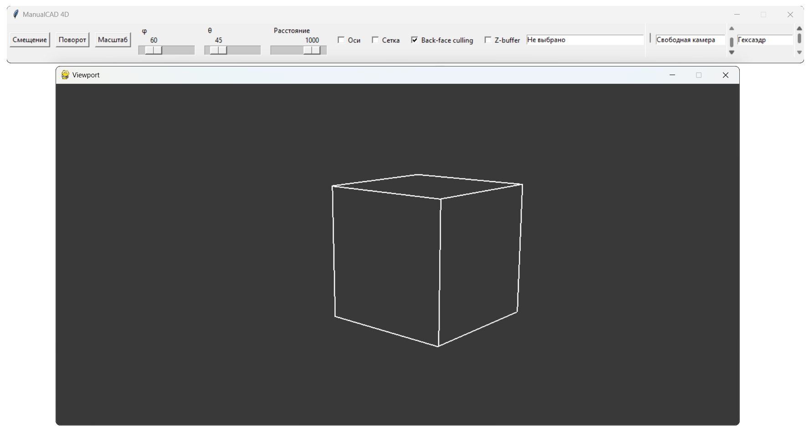
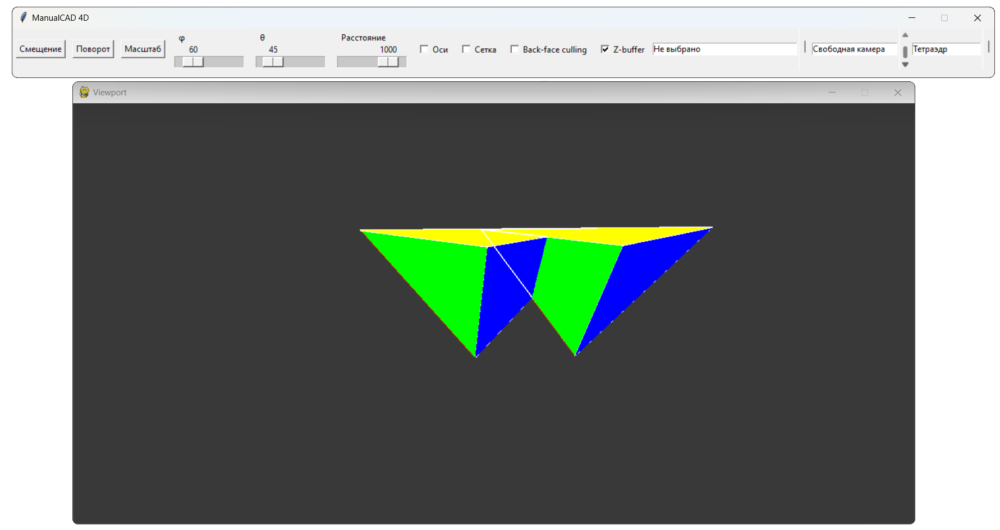

# Лабораторная работа №8. Удаление невидимых граней
## Задание
### 1. Отсечение нелицевых граней
Изобразить вращающийся объект (созданный ранее) с отсечением нелицевых граней:
- Добавить к каждой грани вектор нормали, направленный вовне, относительно объекта. Вектор нормали вычисляется, как векторное произведение векторов, лежащих в плоскости грани.
- Задать вектор обзора (Можно только параллельную проекцию использовать, а можно переключаться между параллельной и перспективной). Добавить возможность его изменения.
- Реализовать отсечение нелицевых граней с учетом вектора нормали и направления обзора.
### 2. Алгоритм Z-буфера
Реализовать алгоритм z-буфера для удаления невидимых граней. Направление обзора может быть фиксированным (Можно только параллельную проекцию использовать, а можно переключаться между параллельной и перспективной).
- Добавить возможность применять преобразования к отображаемому объекту.
- Если объект выпуклый, то необходимо добавить еще несколько объектов для демонстрации корректной работы алгоритма в случае перекрытия.
### 3. Камера
Добавить объект-камеру.
- Камера задается своим положением, направлением обзора и матрицей проекционного преобразования.
- Получить изображение с камеры, вращая её вокруг статического объекта (Перспективная проекция).
## Демонстрация работы

